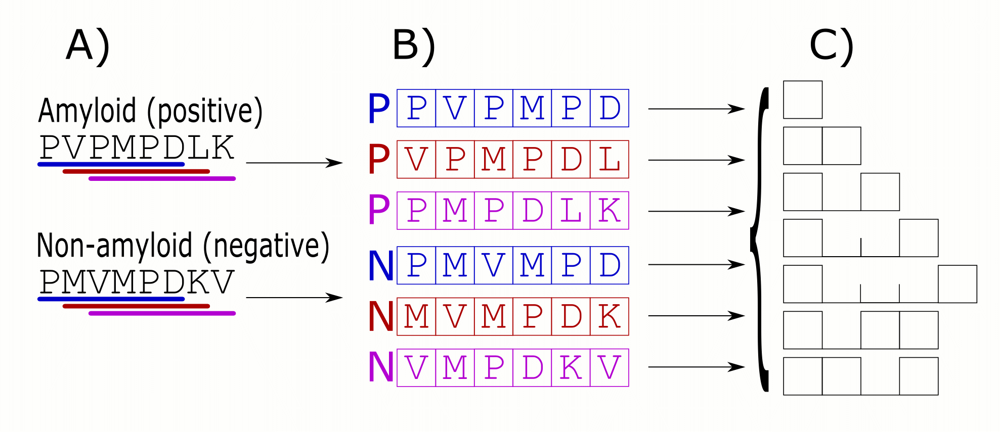

## Amyloidy

Białka amyloidogenne zawierają *hot-spots*, krótkie sekwencje aminokwasów, które powodują agregowanie białek w zazwyczaj cytotoksyczne kompleksy [@fandrich_oligomeric_2012]. 

Agregaty amyloid są przyczyną różnych zaburzeń (m.in. choroby Alzheimera, Creutzfelda-Jacoba). Mimo podobieństw w procesie agregacji, białka amyloidogenne są zróżnicowane pod względem długości i składu aminokwasowego [@breydo_structural_2015].

## n-gramy (k-mery)

```{r echo=FALSE,message=FALSE}
library(ggplot2)
library(grid)
library(biogram)
library(knitr)
library(DT)
library(seqinr) 
library(dplyr)
library(rbokeh)
library(reshape2)
library(DiagrammeR)

load("report4.RData")
load("poster_data.RData")
load("specsens.RData")
load("metrics.RData")


size_mod <- -4
cool_theme <- theme(plot.background=element_rect(fill = "transparent",
                                                 colour = "transparent"),
                    panel.grid.major = element_line(colour="lightgrey", linetype = "dashed"),
                    panel.background = element_rect(fill = "white",colour = "black"),
                    legend.background = element_rect(fill="NA"),
                    legend.position = "right",
                    axis.text = element_text(size=12 + size_mod),
                    axis.title.x = element_text(size=16 + size_mod, vjust = -1), 
                    axis.title.y = element_text(size=16 + size_mod, vjust = 1),
                    strip.text = element_text(size=12 + size_mod, face = "bold"),
                    strip.background = element_rect(fill="grey", colour = "black"),
                    legend.text = element_text(size=13 + size_mod), 
                    legend.title = element_text(size=17 + size_mod),
                    plot.title = element_text(size=20 + size_mod))

options(DT.options = list(iDisplayLength = 6, searching = FALSE, bLengthChange = FALSE))
```

n-gramy (k-mery, k-tuple) to wektory o długości $n$ zawierające znaki z sekwencji wejściowych.

Pierwotnie analiza n-gramów rozwijana była na potrzeby analizy języka naturalnego, ale ma również zastosowania w genomice [@fang2011], transkryptomice [@wang2014] i proteomice [@guo2014].

## Przykładowe sekwencje

```{r echo=FALSE,message=FALSE,results='asis'}
set.seed(1)
sample_seq <- matrix(sample(c("A", "C", "G", "T"), 30, replace = TRUE), nrow = 5)
colnames(sample_seq) <- paste0("P", 1L:ncol(sample_seq))
rownames(sample_seq) <- paste0("S", 1L:nrow(sample_seq))
#kable(data.frame(sample_seq), format = "markdown", caption = "", digits = 0)
datatable(sample_seq)
```

S - sekwencje, P - pozycja nukleotydu.

## Zliczenia 1-gramów

```{r echo=FALSE,message=FALSE,results='asis'}
unis <- count_ngrams(sample_seq, 1, c("A", "C", "G", "T"))
unis <- data.frame(as.matrix(unis))
colnames(unis) <- c("A", "C", "G", "T")
rownames(unis) <- paste0("S", 1L:nrow(sample_seq))
datatable(t(unis))
```

## Zliczenia 2-gramów

```{r echo=FALSE,message=FALSE,results='asis'}
unis <- count_ngrams(sample_seq, 2, c("A", "C", "G", "T"))
unis <- data.frame(as.matrix(unis))

colnames(unis) <- sapply(colnames(unis), function(i) 
                         paste0(substr(i, 0, 1), substr(i, 3, 3)))

#colnames(unis) <- c("A", "C", "G", "T")
rownames(unis) <- paste0("S", 1L:nrow(sample_seq))
datatable(t(unis))
```


## Całkowita liczba n-gramów

$$n_\text{max} = u^n$$

$n_\text{max}$: liczba wszystkich możliwych n-gramów

$u$: liczba liter w alfabecie.

$n$: długość n-gramu

## Całkowita liczba n-gramów

```{r echo=FALSE,message=FALSE}
n <- 1:6
n_max <- 4^n

dat <- data.frame(n, n_max)

# ggplot(dat, aes(x = n, y = n_max)) + 
#   geom_line(linetype="dotted", size=1.5) + 
#   geom_point(size=4, shape=21, fill = "black") +
#   scale_x_continuous(breaks = 0L:6) +
#   scale_y_continuous(expression(n["max"])) + 
#   cool_theme

figure(width = 800, tools = c("pan", "wheel_zoom", "reset")) %>%
  ly_points(n, n_max, data = dat, hover = c(n, n_max)) %>%
  ly_lines(n, n_max, data = dat)
```  

## Informacja o pozycji

n-gramy mogą mieć przypisaną informację o pozycjach na których występują.

```{r echo=FALSE,message=FALSE,results='asis'}
datatable(sample_seq)
```

## Pozycjonowane n-gramy

```{r echo=FALSE,message=FALSE,results='asis'}
unis <- count_ngrams(sample_seq, 2, c("A", "C", "G", "T"), pos = TRUE)
unis <- data.frame(as.matrix(unis))

colnames(unis) <- substr(colnames(unis), 2, 6)
colnames(unis) <- sub(".", "", colnames(unis), fixed = TRUE)

#colnames(unis) <- c("A", "C", "G", "T")
rownames(unis) <- paste0("S", 1L:nrow(sample_seq))
datatable(t(unis))

```

## Liczba pozycjonowanych n-gramów

$$n_\text{max} = p \times u^n$$

$n_\text{max}$: liczba wszystkich możliwych n-gramów

$p$: liczba możliwych pozycji.

$u$: liczba liter w alfabecie.

$n$: długość n-gramu

## Liczba pozycjonowanych n-gramów

```{r echo=FALSE,message=FALSE}
dat <- melt(sapply(c(1, 2:5*5), function(i) i * n_max))
dat[["Var2"]] <- factor(dat[["Var2"]])
levels(dat[["Var2"]]) <- c(1, 2:5*5)
colnames(dat) <- c("n", "p", "n_max")
levels(dat[["p"]]) <- paste0("p = ", levels(dat[["p"]]))

figure(xlim = c(0.9, 7), width = 800, tools = c("pan", "wheel_zoom", "reset")) %>%
  ly_points(n, n_max, color = p, data = dat, hover = c(n, p, n_max)) %>%
  ly_lines(n, n_max, color = p, data = dat)
```  

## Nieciągłe n-gramy

n-gramy są nieciągłe, kiedy pomiędzy elementami n-gramu mogą występować przerwy.

```{r echo=FALSE,message=FALSE,results='asis'}
datatable(sample_seq)
```

## Zliczenia 2-gramów z przerwą 1

```{r echo=FALSE,message=FALSE,results='asis'}
unis <- count_ngrams(sample_seq, 2, c("A", "C", "G", "T"), d = 1)
unis <- data.frame(as.matrix(unis))

colnames(unis) <- decode_ngrams(colnames(unis))

#colnames(unis) <- c("A", "C", "G", "T")
rownames(unis) <- paste0("S", 1L:nrow(sample_seq))
datatable(t(unis))
```

## Wybór informatywnych n-gramów

QuiPT (**Qui**ck **P**ermutation **T**est) szybko filtruje zmienne za pomocą testu statystycznego.

## Test permutacyjny

W teście permutacyjnym oznaczenia klas są losowo mieszane na potrzeby obliczania statystyki testowej.

$$     
\text{p-value} = \frac{N_{T_P > T_R}}{N},
$$

gdzie $N_{T_P > T_R}$ to liczba losowań, kiedy $T_P$ (permutowana statystyka testowa) miała wartość 
krytyczniejszą niż $T_R$ (statystyka testowa dla niespermutowanych danych).

Powyższy test permutacyjny jest równoważny dwustronnemu dokładnemu testowi Fishera. Ponieważ nasze wektory związane z n-gramami są bardzo rzadkie (wiele zer), uzyskujemy istotne przyspieszenie i poprawę jakości obliczanych p-wartości.


## Baza AmyLoad

```{r echo=FALSE,message=FALSE,results='asis'}
totals <- seq_inter_ct %>% group_by(tar) %>% summarize(total = sum(Freq)) %>% select(total) %>% unlist
seq_inter_ct_pl <- seq_inter_ct
levels(seq_inter_ct_pl[["tar"]]) <- c("nie", "tak")

ggplot(seq_inter_ct_pl, aes(x = len, y = Freq, fill = tar, label = Freq)) +
  geom_bar(position = "dodge", stat = "identity") +
  scale_fill_manual("Amyloid", values = c("skyblue", "tan2")) +
  scale_x_discrete("Długość peptydu\n") +
  scale_y_continuous("Liczba sekwencji") + 
  geom_text(size = 3, position = position_dodge(width = 0.9), vjust=-0.25) +
  cool_theme + theme(legend.position = "bottom")
```

Sekwencje (`r totals[1]` nie-amyloid i `r totals[2]` amyloid) pobrano z bazy AmyLoad [@wozniak_amyload:_2015].

## Grupowanie aminokwasów

 - Wybrano dziewięć skal istotnych w procesie amyloidogenności: hydrofobowość, rozmiar, polarność, dostępność dla rozpuszczalnika i kontaktywność [@wozniak_characteristics_2014].
 - Wszystkie kombinacje skal (za każdym razem wybierając tylko jedną skalę dla danej właściwości) były gropowane używając dystansu euklidesowego i metody Warda.  
 - Każde grupowanie było podzielone na od trzech do sześciu kodowań tworząc 144 kodowania.
 - Redundatne 51 kodowań (identycznych z innymi kodowaniami) zostało usuniętych.

## Przygotowanie danych

 - Odrzucono sekwencje krótsze niż 6 aminokwasów.
 - Dla każdej sekwencji odczytano zachodzące okna o długości 6. Każde okno zostało oznaczone tak samo jak sekwencja z której zostało wybrane.
 - Z każdego okna wybrano 1-, 2- i 3-gramy (zarówno ciągłe jak i z przerwami). 

## Przygotowanie danych



## Uczenie

 - Dla każdego kodowania osobno, n-gramy przefiltrowano używając metody QuiPT i wykorzystano do uczenia lasów losowych [@liaw_classification_2002]. 
 - Procedurę powtórzono na trzech zbiorach uczących: sekwencje o długości 6 aminokwasów, krótsze niż 11 aminokwasów i krótsze niż 15 aminokwasów. 

## Wyniki walidacji krzyżowej

```{r echo=FALSE,message=FALSE,results='asis'}
res2 <- mutate(res, mAUCc = cut(mAUC, breaks = seq(min(mAUC), max(mAUC), length.out = 6), include.lowest = TRUE, right = TRUE)) %>%
  mutate(best_enc = factor(mSpec == max(mSpec) | mSens == max(mSens)))

colnames(res) <- c("Zbiór uczący", "ID kodowania", "AUC", "Specyficzność", "Czułość", "Liczba grup")

res <- res[, c(1, 6, 2, 3, 5, 4)]

datatable(res, filter = "top", options = list(searching = TRUE), rownames = FALSE) %>% formatRound(4L:7, 4)
```

## Wyniki walidacji krzyżowej

```{r echo=FALSE,message=FALSE}
levels(res2[["best_enc"]]) <- c("Kodowanie", "Najlepsze kodowanie")
levels(res2[["len"]]) <- c("6", "Mniej niż 11", "Mniej niż 16")

figure(width = 800, tools = c("pan", "wheel_zoom", "reset"),
       ylab = "Czułość", xlab = "Specyficzność") %>%
  ly_points(mSpec, mSens, color = best_enc, data = res2, hover = c(len, n, enc, mAUC, mSens, mSpec))
``` 


## Najlepsze kodowania

```{r echo=FALSE,message=FALSE}
enc2df <- function(x) {
  gr_names <- if(is.null(names(x))) {
    1L:length(x)
  } else {
    names(x)
  }
  data.frame(Group = gr_names, Elements = sapply(x, paste0, collapse = ", "))
}

#best specificity
bspec <- list(c("H", "M"),
              c("F", "W", "Y"),
              c("C", "I", "L", "V"),
              c("A"," D", "E", "G", "K", "N", "P", "Q", "R", "S", "T"))

#best sensitivity
bsens <- list(c("A", "T"), 
              c("D", "E", "N"),
              c("G", "P", "S"),
              c("F", "W", "Y"),
              c("H", "K", "Q", "R"),
              c("C", "I", "L", "M", "V"))

both_enc <- cbind(enc2df(bsens), rbind(enc2df(bspec), data.frame(Group = c("-", "-"), Elements = c("-", "-")))[, -1])
both_enc[[1]] <- c("I", "II", "III", "IV", "V", "VI")
colnames(both_enc) <- c("Grupa", "Najlepsza specyficzność", "Najlepsza czułość")
kable(both_enc)

``` 

## Najlepsze kodowania

```{r echo=FALSE,message=FALSE}

tmp <- filter(amylo_freq, n == 1)
tmp <- droplevels(tmp)
#print(levels(tmp[["variable"]]))
levels(tmp[["variable"]]) <- c("I", "II", "III", "IV", "V", "VI")
levels(tmp[["enc"]]) <- c("Najlepsza specyficzność", "Najlepsza czułość")
levels(tmp[["tar"]]) <- c("nie", "tak")
ggplot(tmp, aes(x = variable, y = freq, fill = tar, colour = tar)) +
  geom_bar(stat = "identity", position = "dodge") + 
  scale_y_continuous("Częstość") +
  scale_x_discrete("ID grupy\n") + 
  scale_fill_manual("Amyloid", values = c("nie" = "skyblue", "tak" = "tan2")) +
  scale_colour_manual("Amyloid", values = c("nie" = "skyblue", "tak" = "tan2")) +
  facet_wrap(~ enc, scales = "free_x", ncol = 2) +
  guides(colour = FALSE) +
  cool_theme
``` 

## Komitet klasyfikatorów

Dwaj najlepsze kodowania (najlepsza specyficzność i najlepsza czułość) mają różne obszary kompetencji

AmyloGram, komitet dwóch wymienionych klasyfikatorów, ma AUC $0.8911$, czułość $0.7473$ i specyficzność $0.8684$.


## Porównanie z innymi klasyfikatorami

Wykorzystano zbiór danych **pep424** [@walsh_pasta_2014] do porównania AmyloGramu z najlepszymi predyktorami amyloidogenności.

```{r echo=FALSE,message=FALSE}

metrics <- cbind(rownames(metrics), metrics)
colnames(metrics) <- c("Nazwa predyktora", "AUC", "Czułość", "Specyficzność")

kable(metrics, row.names = FALSE, digits = 4)
``` 

## Podsumowanie

AmyloGram pozwala nie tylko na przewidywanie potencjalnych hot-spots, ale równie na analizę cech świadczących o amyloidogenności.

biogram - pakiet **R** do analizy n-gramowej: https://cran.r-project.org/package=biogram

## References
